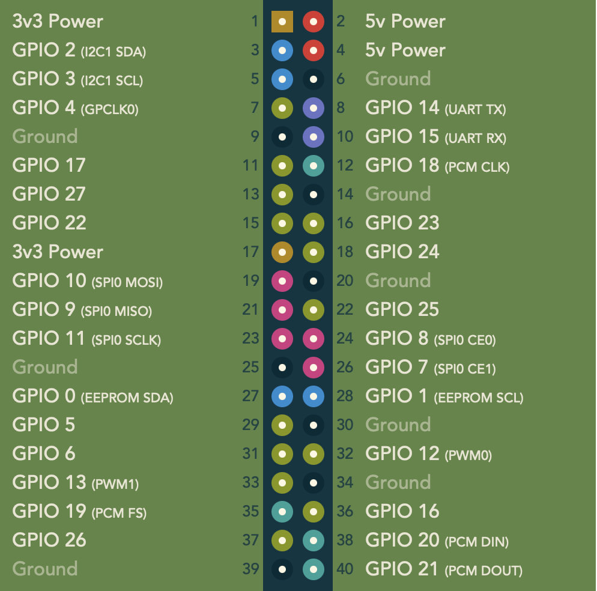

# ButtonPi

ButtonPi is a Raspberry Pi project that enables safe shutdown and start functionality using a momentary push button. It allows you to gracefully power off your Raspberry Pi and easily turn it back on using a physical button.

## Prerequisites

Before getting started, make sure you have the following:

- Raspberry Pi board
- Momentary push button
- Jumper wires
- Basic knowledge of using the Raspberry Pi terminal

## Installation

1. Connect the momentary push button to your Raspberry Pi following the pinout diagram below:

   

2. Clone the ButtonPi repository to your Raspberry Pi by running the following command in the terminal:
   ```
   git clone https://github.com/lohitkolluri/ButtonPi.git
   ```

3. Navigate to the ButtonPi directory:
   ```
   cd ButtonPi
   ```

4. Make the installation script executable:
   ```
   chmod +x install.sh
   ```

5. Run the installation script with root privileges:
   ```
   sudo ./install.sh
   ```

   Follow the on-screen prompts to complete the installation.

## Usage

1. Power on your Raspberry Pi.

2. Press the momentary push button once to initiate the safe shutdown process.

3. Wait for the Raspberry Pi to shut down completely before proceeding.

4. To start the Raspberry Pi again, press the push button.

## Uninstallation

To uninstall ButtonPi and remove associated files, follow these steps:

1. Open a terminal on your Raspberry Pi.

2. Navigate to the ButtonPi directory:
   ```
   cd ButtonPi
   ```

3. Run the uninstallation script with root privileges:
   ```
   sudo ./uninstall.sh
   ```

   Follow the on-screen prompts to complete the uninstallation.

## Troubleshooting

- If the shutdown button does not work, double-check the wiring connections and ensure they match the pinout diagram.
- For any issues or questions, please create an issue on the [ButtonPi GitHub repository](https://github.com/lohitkolluri/ButtonPi) for assistance.

## Acknowledgments

- Raspberry Pi pinout diagram adapted from the official Raspberry Pi Foundation [Pinout documentation](https://pinout.xyz/).
